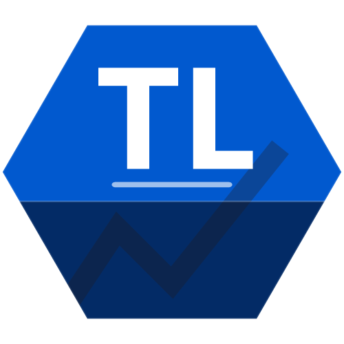

# TrackLogic

[中文](README.md) | [English](README_EN.md)

**Every lap leaves a trace.**

iRacing telemetry recording, lap analysis, live HUD, and driver-training tools

[Download from apexracing.cn](https://apexracing.cn/)

TrackLogic is a Windows desktop companion for sim racers. It connects to iRacing, records telemetry in the background, and turns driving data into practical feedback for your next lap.

TrackLogic currently focuses on **iRacing**. For the latest client, installer, compatibility information, and product updates, visit the [official Apex Racing website](https://apexracing.cn/).

## Why TrackLogic

Lap time tells you how much time you lost. Telemetry helps you understand why. TrackLogic brings session recording, telemetry charts, lap comparison, track maps, and live driving assistance into one workflow:

1. Launch TrackLogic and iRacing.
2. Drive a practice, qualifying, or race session while TrackLogic records available telemetry.
3. Review lap times, sectors, and telemetry after the session.
4. Compare your laps or choose a suitable community reference lap.
5. Adjust braking points, corner entry speed, racing line, and throttle application for the next run.

## Main features

### Telemetry recording and personal garage

- Automatically record practice, qualifying, and race sessions.
- Search your records by season, track, car, and time.
- Keep lap, sector, stint, fuel, and tire data together in your personal garage.
- Track your progress across repeated sessions.

### Lap and telemetry analysis

- Review fastest laps, average pace, sectors, and lap counts.
- Compare up to four laps to locate gains and losses around the track.
- Inspect speed, throttle, brake, steering, clutch, and gear traces.
- Review tire temperature, pressure, wear, fuel usage, and pit-stop information when available.
- Compare laps by time or track distance.

### Track maps and driving performance

- Visualize the driven line and car position on a track map.
- Connect lap time, sector performance, and track position to understand corner-by-corner behavior.
- Use personal and community data to build meaningful reference laps.

### Live HUD and driving assistance

TrackLogic can display live information over the game so you do not need to switch windows while driving. Available modules include:

- Driving inputs: throttle, brake, clutch, steering, and gear.
- Overall standings and relative positions.
- Track map and live car positions.
- Spotter alerts and voice notifications.
- Blind-spot monitoring for cars alongside you.
- Reference-lap comparison, speed delta, and PaceDelta.
- Visual and audio brake cues based on a reference lap.
- A Dynamic-Island-style information panel with previewable, editable, and scalable HUD layouts.

### Racing Academy and practice

Racing Academy turns telemetry feedback into repeatable practice. Train around reference laps, braking points, pace differences, and driving inputs while building a clearer understanding of your own driving style.

### Community and performance data

- Explore community lap data and reference laps.
- Use community data in your own lap comparisons.
- Follow progress across tracks and sessions.
- Review frame rate, latency, communication quality, and other performance signals to help diagnose online or system issues.

## Download and installation

Get the latest Windows installer from the official website:

**[https://apexracing.cn/](https://apexracing.cn/)**

The official website is the source for the current version, installer, compatibility information, and product updates. Avoid downloading the client from unknown mirrors or repackaged third-party sites.

## Quick start

1. Visit [apexracing.cn](https://apexracing.cn/) and download the latest TrackLogic installer.
2. Install and launch TrackLogic, then sign in or create an account.
3. Start iRacing and enter a practice, qualifying, or race session.
4. Make sure iRacing is allowed to save telemetry to disk.
5. Drive normally. TrackLogic will process the available telemetry after the session.
6. Open your telemetry garage, compare laps, and use the results to plan your next run.

## Tips

- Complete a full session before starting your first analysis.
- For meaningful comparisons, use the same car, track, and similar session conditions.
- Preview and configure HUD modules before using them during a live session.
- If no telemetry appears, fully exit iRacing and check its telemetry-saving setting and available disk space.
- If synchronization fails, check the network connection and retry from the app.

## FAQ

### Which simulators are supported?

The current release focuses on iRacing. Support for other simulators depends on the release and should be confirmed on the [official website](https://apexracing.cn/) or in the client.

### Why is there no telemetry record after driving?

Make sure iRacing is fully running, you entered a driving session, and telemetry saving is enabled. After finishing, allow TrackLogic time to process the session. If the record is still missing, check your network connection and available disk space, then retry in the app.

### Is TrackLogic open source?

This repository contains user documentation for TrackLogic. It does not mean that the desktop client source code is fully open. The installer, release information, and product details are provided through the official website.

### Where can I get updates and support?

Visit [apexracing.cn](https://apexracing.cn/) for the latest installer, release information, and official support links.

## Search terms

TrackLogic, iRacing telemetry, iRacing telemetry analysis, sim racing software, racing telemetry, lap comparison, iRacing HUD, live telemetry overlay, track map, blind spot spotter, brake cue, racing academy, Windows sim racing tool.

## Disclaimer

iRacing is a trademark of iRacing.com Motorsport Simulations, LLC. TrackLogic is an independent third-party tool and is not affiliated with, endorsed by, or sponsored by iRacing.com Motorsport Simulations, LLC.
